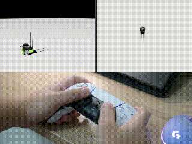

# Isaac Sim DualSense Teleop

[English](README.md) | 简体中文

使用 Sony PlayStation 5 DualSense 手柄，在 NVIDIA Isaac Sim 中操控 JetBot 和 UR10。

Isaac Sim 的 OmniGraph `Read Gamepad State` 工作流主要面向 Xbox 风格的手柄映射。本项目改用 `pygame` 读取 DualSense，并把输入接入正在运行的 Isaac Sim 场景，无需修改机器人官方资产。



> **实测环境，而非泛化支持声明**
>
> - Windows
> - Isaac Sim 6.0.1
> - pygame 2.6.1
> - 控制器名称：`DualSense Wireless Controller`
>
> 尚未测试 Linux、其他 Isaac Sim 版本、其他手柄或所有有线/无线连接方式。UR10 示例为实验性功能。

## 功能

- `examples/jetbot_teleop.py`：JetBot 差速移动，适合作为稳定的入门示例。
- `examples/ur10_teleop.py`：UR10 TCP 笛卡尔空间控制，包含奇异位形降速、软关节限位和目标跟随限制；当前标记为 **experimental**。
- `input/dualsense_input.py`：基于 `pygame` 的通用 DualSense 输入层，负责死区、扳机归一化和按键边沿检测。
- `config/dualsense_mapping.json`：手柄轴和按键编号映射。

## 运行环境原理

这里有两个相关但用途不同的 Python 入口：

- `<ISAAC_SIM_DIR>\python.bat` 是 Isaac Sim 自带的 Python 启动器，用于安装和检查依赖，也可以运行独立的 Isaac Sim 程序。
- **Isaac Sim VS Code Edition > Run** 会把编辑器中的当前文件发送给已启动的 Isaac Sim 内部 Python Server。JetBot 和 UR10 示例需要使用这种交互执行方式，因为它们依赖当前已经打开的 Stage 和时间线。

Isaac Sim 自带的 `.vscode/settings.json` 只负责 VS Code 的代码分析和解释器配置，不会安装依赖，也不能代替 Python Server 连接。

## 安装与连接

### 1. 前置条件

先安装并确认可以正常启动 Isaac Sim 6.0.1。本仓库不包含 Isaac Sim、JetBot 或 UR10 的模型、mesh、材质等第三方资产。

克隆本仓库后，分别修改 `examples/jetbot_teleop.py` 和 `examples/ur10_teleop.py` 顶部的 `PROJECT_ROOT`：

```python
# Replace this with the directory where you cloned this repository.
PROJECT_ROOT = Path(r"D:\isaacsim_dualsense_teleop")
```

这里有意使用明确路径，因为 Isaac Sim Python Server 会把收到的源码作为 `"<string>"` 执行，不能保证通过 `__file__` 得到原文件位置。路径错误时，脚本会明确提示需要修改哪个 teleop 文件中的 `PROJECT_ROOT`。

### 2. 把 pygame 安装到 Isaac Sim 自带的 Python

不要只把 `pygame` 安装到系统 Python 或普通虚拟环境。请在 PowerShell 中把下面的 Isaac Sim 路径替换为你自己的安装位置：

```powershell
& "C:\path\to\isaacsim\python.bat" -m pip install -r "D:\path\to\isaacsim-dualsense-teleop\requirements.txt"
```

也可以只安装已实测版本：

```powershell
& "C:\path\to\isaacsim\python.bat" -m pip install pygame==2.6.1
```

验证安装：

```powershell
& "C:\path\to\isaacsim\python.bat" -c "import pygame; print(pygame.version.ver)"
```

安装后重启 Isaac Sim。如果输出 `ModuleNotFoundError: pygame`，通常表示安装到了另一个 Python 环境。

### 3. 连接 VS Code 与 Isaac Sim

1. 在 Isaac Sim 的 Extension Manager 中搜索并启用 `isaacsim.code_editor.vscode`，它会同时启用 Python Server。
2. 在 VS Code 中安装 NVIDIA 的 **Isaac Sim VS Code Edition** 扩展。
3. 在 Isaac Sim 菜单中选择 **Window > VS Code**。这样会打开你自己的 Isaac Sim 安装目录，并使用该安装随附的 `.vscode` 配置。
4. 使用 VS Code 的 **File > Open File...** 打开 teleop 文件即可；是否把本仓库加入 workspace 是可选的。

Isaac Sim 安装目录中的 `.vscode` 通常包含 `settings.json`、`launch.json` 和 `tasks.json`。请使用**你自己安装的 Isaac Sim 所附带的配置**。本仓库不提供 settings 模板，也不会跟踪本机 `.vscode/settings.json`，以免提交安装路径或用户名等机器相关信息。

### 4. 可选的仓库 task

如果把本仓库作为 VS Code workspace 打开，`.vscode/tasks.json` 提供 **Run with Isaac Sim Python**。它默认使用 `C:\isaacsim\python.bat`；如果 Isaac Sim 安装在其他位置，请修改 task 中的 `command`。工作目录使用 `${workspaceFolder}`，不需要填写仓库绝对路径。

这个 task 会把当前文件作为独立 Python 进程运行，保留它是为了方便运行其他脚本，但它**不是**两个 teleop 示例的启动方式。官方文档也说明，独立的 `Python: Current File` 不适用于 extension/interactive code。运行 `jetbot_teleop.py` 和 `ur10_teleop.py` 时，请使用 Isaac Sim 扩展侧栏中的 **Run**。

参考：[Isaac Sim 6.0.1 — Visual Studio Code](https://docs.isaacsim.omniverse.nvidia.com/6.0.1/development_tools/vscode.html)


## 运行示例

开始前先连接 DualSense，并关闭可能独占手柄的其他程序。

### JetBot

1. 在 Isaac Sim 中打开 `examples/jetbot_scene.usd`。
2. 等待 JetBot 官方资产加载完成，确认 Stage 中存在 `/World/jetbot`。
3. 点击 Isaac Sim 的 **Play**。
4. 在 VS Code 中打开 `examples/jetbot_teleop.py`，不要只选中一段代码。
5. 打开 VS Code 活动栏中的 Isaac Sim 面板，点击 **Run**。
6. 在 Isaac Sim VS Code Edition 输出面板确认出现 `DualSense JetBot Teleop ACTIVE`。

| DualSense 输入 | JetBot 动作 |
| --- | --- |
| 左摇杆 上 / 下 | 前进 / 后退 |
| 左摇杆 左 / 右 | 左转 / 右转 |
| Cross（×） | 紧急停止 |
| Triangle（△） | 紧急停止后重新启用 |

### UR10（experimental）

1. 在 Isaac Sim 中打开 `examples/ur10_scene.usd`。
2. 等待 UR10 官方资产加载完成，确认 Stage 中存在 `/World/ur10` 和 `/World/ur10/ee_link/tcp`。
3. 点击 Isaac Sim 的 **Play**。
4. 在 VS Code 中打开完整的 `examples/ur10_teleop.py`，然后在 Isaac Sim 插件点击 **Run**。
5. 在输出面板确认出现 `DualSense UR10 TCP Teleop ACTIVE`。

| 模式 | DualSense 输入 | UR10 动作 |
| --- | --- | --- |
| 默认 | 左摇杆 左 / 右 | TCP 世界坐标 X− / X+ |
| 默认 | 左摇杆 上 / 下 | TCP 世界坐标 Y+ / Y− |
| 默认 | 右摇杆 上 / 下 | TCP 世界坐标 Z+ / Z− |
| 默认 | 右摇杆 左 / 右 | 绕世界坐标 X 轴 Roll |
| 按住 R2 | 左摇杆 左 / 右 | 绕世界坐标 Y 轴 Pitch |
| 按住 R2 | 左摇杆 上 / 下 | 绕世界坐标 Z 轴 Yaw |
| 任意 | Cross（×） | 紧急停止并保持当前关节目标 |
| 任意 | Triangle（△） | 重新同步当前姿态并启用 |

按住 R2 时，左摇杆从 XY 平移切换为 Pitch/Yaw，平移命令暂停。停止 Isaac Sim 时间线后，示例会尝试把 UR10 恢复到场景中的 `pose_1`。关节限位和奇异位形保护不能替代完整的运动规划或碰撞规避。

### 切换示例

先停止时间线并打开另一个场景，再按上述顺序 **Play → Run**。脚本会清理此前运行的 JetBot 或 UR10 回调，但不要同时操控两套场景。

## 场景和资产说明

仓库内的两个小型 USD 文件只是场景配置层。它们通过远程 `payload` 引用 Isaac Sim 6.0 资产服务器上的 JetBot 和 UR10，并未包含或重新分发机器人 mesh、材质或纹理。首次打开场景需要网络连接；离线使用时，请按照 Isaac Sim 官方文档配置官方资产包，而不要把第三方资产提交到本仓库。

相关资料：[Isaac Sim Robot Assets](https://docs.isaacsim.omniverse.nvidia.com/6.0.0/assets/usd_assets_robots.html) · [Isaac Sim License FAQ](https://docs.isaacsim.omniverse.nvidia.com/6.0.1/common/license-faq.html)

## 手柄映射与调整

当前映射来自上述 Windows 实测环境。SDL/pygame 在不同操作系统、驱动或连接方式下可能给出不同的轴和按键编号。如果摇杆或按键不对应，请修改 `config/dualsense_mapping.json`，不要修改机器人控制逻辑。修改后重新运行当前 teleop 脚本。

当前底层编号：

| 名称 | 类型 | pygame 编号 |
| --- | --- | ---: |
| `left_x`, `left_y` | axis | 0, 1 |
| `right_x`, `right_y` | axis | 2, 3 |
| `l2`, `r2` | axis | 4, 5 |
| `cross`, `circle`, `square`, `triangle` | button | 0, 1, 2, 3 |
| `l1`, `r1` | button | 9, 10 |
| D-pad 上、下、左、右 | button | 11, 12, 13, 14 |

## 常见问题

- **`No gamepad detected.`**：在启动/运行脚本前连接手柄；确认 Windows 游戏控制器面板和 pygame 能看到它。
- **`ModuleNotFoundError: pygame`**：用 Isaac Sim 安装目录下的 `python.bat` 重新安装，而不是系统 `python`。
- **找不到 `dualsense_input.py` 或映射 JSON**：修正两个 teleop 文件顶部的 `PROJECT_ROOT`，并保持仓库目录结构完整。
- **找不到 `/World/jetbot`、`/World/ur10` 或 TCP**：打开对应的仓库场景，等待远程资产完成加载后再点击 Play。
- **机器人模型没有加载**：检查网络和 Isaac Sim 资产服务；本仓库不会提供官方资产的副本。
- **VS Code Run 无响应**：确认 Isaac Sim 与 VS Code 两侧扩展都已启用，并从 Isaac Sim 的 **Window > VS Code** 启动工作区。
- **Linux 或其他版本出现映射/API 错误**：目前只验证了 Windows + Isaac Sim 6.0.1；欢迎提供完整版本、控制器名称和 pygame 轴/按键输出后提交 issue。

## 安全与免责声明

本项目是非官方社区工具，与 NVIDIA、Sony Interactive Entertainment 或 Universal Robots 无隶属或认可关系。所有商标归各自所有者所有。

本项目仅用于 Isaac Sim 中的仿真遥操作演示，不保证适合真实机器人控制。请勿未经独立的安全评估、硬件急停、碰撞检测和工作空间防护就连接实体机器人。软件按 MIT License “原样”提供，不附带任何保证。

## License

本仓库原创代码采用 [MIT License](LICENSE)。Isaac Sim 及其远程加载的机器人资产受各自许可证约束，不包含在本仓库的 MIT 授权范围内。
